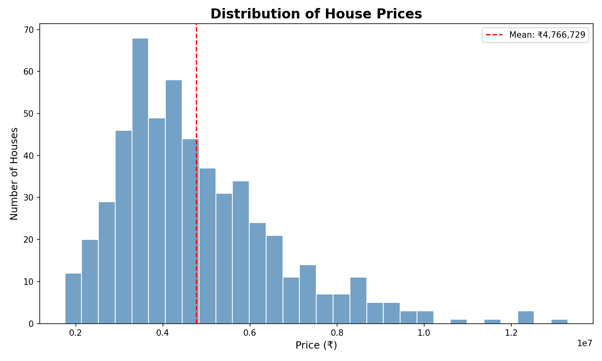
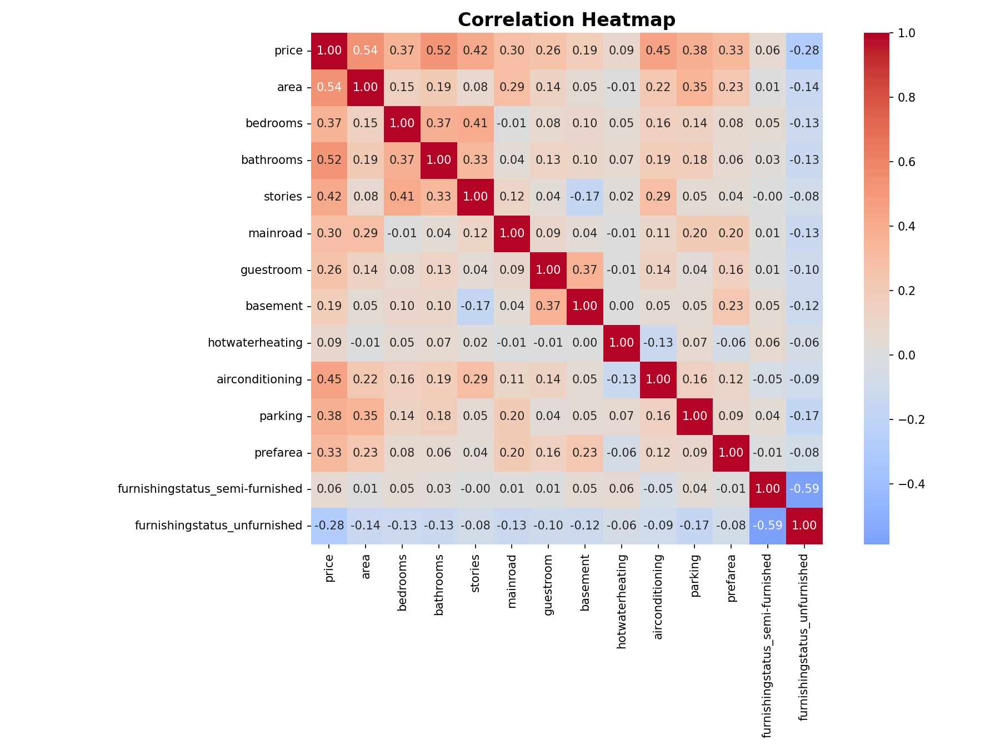
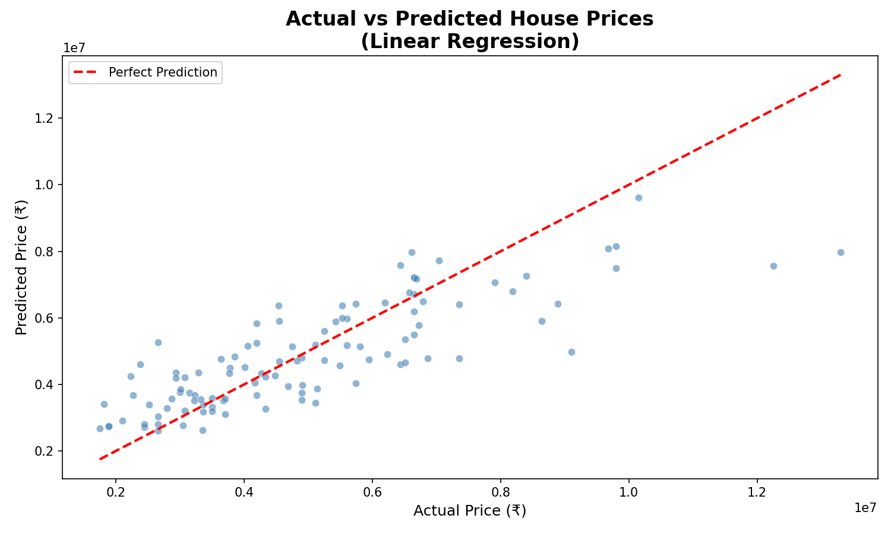

#  House Price Prediction

A machine learning project built during my Week 1 Data Science internship.
The goal was to predict house prices based on features like area, 
number of bathrooms, and air conditioning using regression models.

---

##  Dataset
- Source: [Kaggle - Housing Prices Dataset]
(https://www.kaggle.com/datasets/yasserh/housing-prices-dataset)
- 545 houses, 13 features
- No missing values or duplicates

---

##  Tools Used
- Python (Google Colab)
- Pandas : data cleaning
- Scikit-learn : model building
- Matplotlib & Seaborn : visualizations

---

##  What I Did
1. Loaded and explored the dataset
2. Cleaned data : encoded yes/no columns and furnishing status
3. Trained two models and compared them
4. Created 3 visualizations
5. Wrote findings and recommendations

---

##  Model Results

| Model | MAE | RMSE | R² Score |
|---|---|---|---|
| Linear Regression | Rs. 9,70,043 | Rs. 13,24,507 | 0.6529 |
| Random Forest | Rs. 10,22,560 | Rs. 14,01,497 | 0.6114 |

**Winner: Linear Regression** (surprisingly), the simpler model 
performed better on this small dataset!

---

## 🔍 Key Findings
- **Area** is the strongest predictor of price (correlation: 0.54)
- **Bathrooms** and **air conditioning** also significantly affect price
- Hot water heating had almost no effect (0.09) , surprising!
- Most houses are under Rs. 50 lakh but a few luxury homes 
  cross Rs. 1 crore, making the data right-skewed

---

##  Charts

### Price Distribution

### Correlation Heatmap

### Actual vs Predicted

---

##  Business Recommendation
Focus on larger properties , area is the #1 driver of price.
Adding bathrooms and AC can further boost property value.
